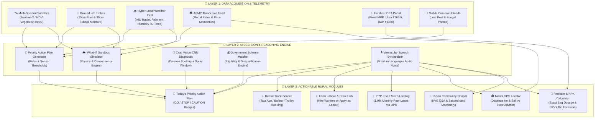
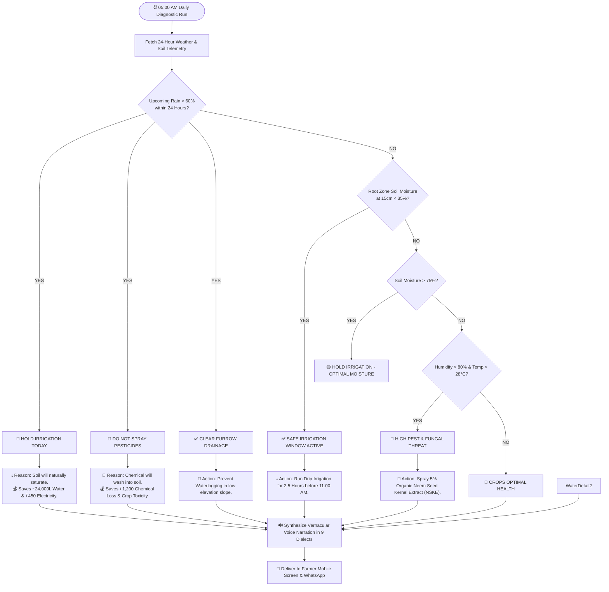
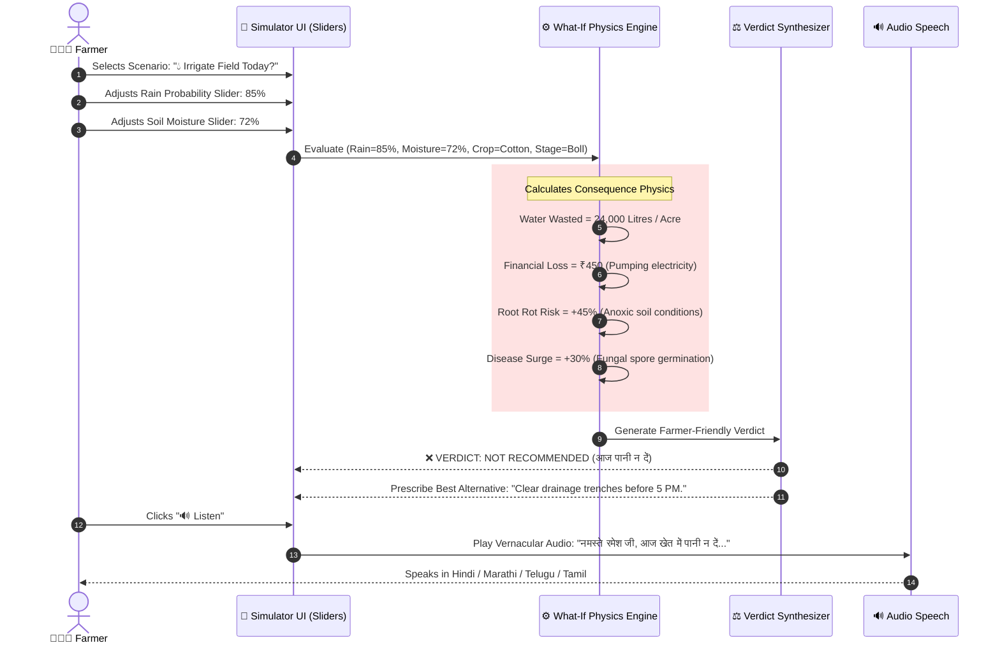
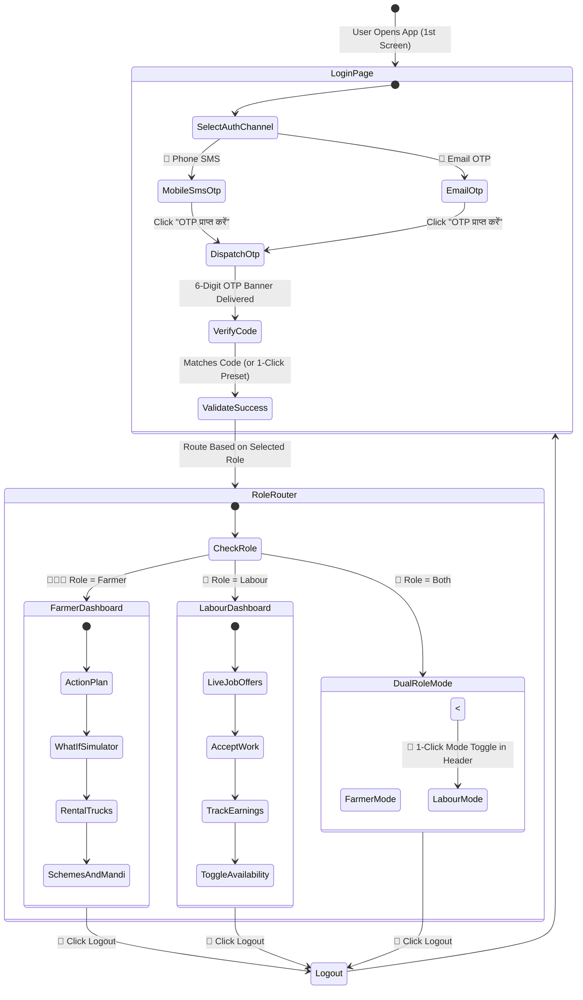
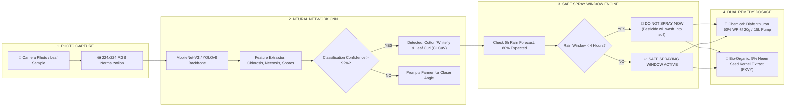
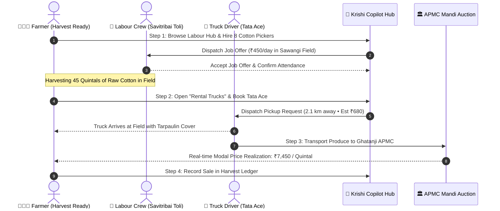
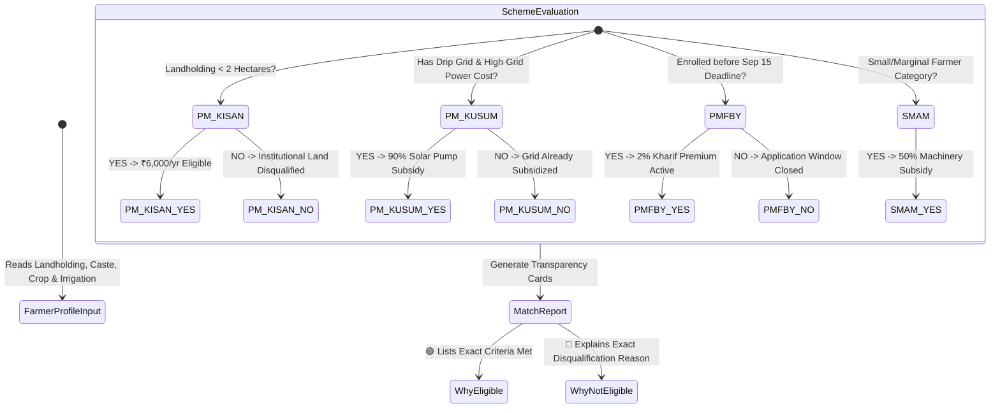
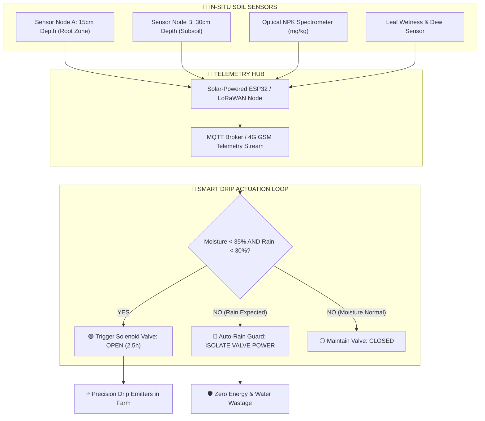
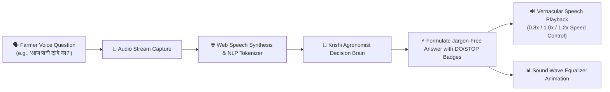

<div align="center">

# 🌾 Krishi Copilot (कृषि को-पायलट)
### *AI-Powered Integrated Farming Decision Support & Precision Agritech Platform*

[](https://react.dev/)
[](https://www.typescriptlang.org/)
[](https://tailwindcss.com/)
[](https://vitejs.dev/)
[](https://github.com/)

<p align="center">
  <strong>Transforming complex agricultural data into timely, jargon-free STOP / DO decisions for Indian farmers.</strong>
</p>

</div>

---

## 🗺️ System Blueprint & Visual Index

```
   ┌────────────────────────────────────────────────────────────────────────┐
   │                     KRISHI COPILOT ARCHITECTURE                         │
   └────────────────────────────────────────────────────────────────────────┘
                                    │
    ┌───────────────────────────────┼───────────────────────────────┐
    │                               │                               │
    ▼                               ▼                               ▼
[1. DATA TELEMETRY]         [2. AI DECISION CORE]          [3. RURAL ACTUATORS]
├── 🛰️ Satellite Multi-Spectral  ├── 🧠 Priority Action Engine   ├── 🌾 Today's Action Plan
├── 📡 Dual-Depth Soil IoT       ├── 🌦️ What-If Simulation       ├── 🚚 Harvest Truck Rental
├── 🌧️ Hyper-Local Weather 1km   ├── 📸 Vision Disease CNN       ├── 👷 Farm Labour Crew
├── 🏛️ APMC Mandi e-NAM Auctions ├── 💰 Scheme Matcher (Why/Not) ├── 🤝 1% P2P Micro-Loans
└── 🧪 DBT Subsidized Fertilizers└── 🎙️ Vernacular Voice AI      └── 🚰 Smart Drip Solenoid
```

---

## 🏗️ 1. End-to-End Agritech Ecosystem Architecture



---

## ⚡ 2. AI Prescriptive Decision Flowchart (Stop vs Do)



---

## 🌦️ 3. 'What-If' Sandbox Decision Simulation Engine



---

## 🔐 4. Multi-Role Authentication & Access Flow



---

## 📸 5. Crop Disease AI & Weather-Linked Spraying Pipeline



---

## 🚚 6. Farm Logistics & Labour Supply Chain Interaction



---

## 💰 7. Government Scheme Matcher State Machine



---

## 📡 8. IoT Hardware Hub & Dual-Depth Closed-Loop Actuation



---

## 🎙️ 9. Vernacular Voice AI Processing Pipeline



---

## 🇮🇳 10. Multi-Dialect Regional Matrix (9 Languages)

```
                            KRISHI COPILOT MULTILINGUAL MATRIX
    ┌──────────────┬───────────────────────────────┬──────────────────────────────────┐
    │ Language     │ Script & Native Name          │ Key Audio & UI Locale            │
    ├──────────────┼───────────────────────────────┼──────────────────────────────────┤
    │ Hindi        │ 🇮🇳 हिन्दी                      │ hi-IN (Standard Kisan Dialect)   │
    │ Marathi      │ 🇮🇳 मराठी                      │ mr-IN (Vidarbha / Marathwada)    │
    │ Telugu       │ 🇮🇳 తెలుగు                     │ te-IN (Andhra & Telangana)       │
    │ Tamil        │ 🇮🇳 தமிழ்                      │ ta-IN (Tamil Nadu Delta)         │
    │ Kannada      │ 🇮🇳 ಕನ್ನಡ                      │ kn-IN (Karnataka Raitha)         │
    │ Gujarati     │ 🇮🇳 ગુજરાતી                    │ gu-IN (Saurashtra / Gujarat)     │
    │ Punjabi      │ 🇮🇳 ਪੰਜਾਬੀ                     │ pa-IN (Malwa / Doaba Belt)       │
    │ Bengali      │ 🇮🇳 বাংলা                      │ bn-IN (West Bengal Agri)         │
    │ English      │ 🌐 English                    │ en-IN (Agronomist / FPO Lead)    │
    └──────────────┴───────────────────────────────┴──────────────────────────────────┘
```

---

## 🏆 Hackathon Judge Cheat Sheet (60-Second Evaluation Guide)

| Test Goal | What to Click in the App | Expected Demonstration Result |
| :--- | :--- | :--- |
| **1. Smart Login Gateway** | Open **[http://localhost:5173/](http://localhost:5173/)** $\to$ Click **"👨🏽‍🌾 Ramesh Patil"** preset. | Immediate 1-click entrance into personalized Cotton farmer dashboard. |
| **2. Prescriptive Action Plan** | Go to **"Today's Action Plan"** tab $\to$ Click **"🔊 Listen"**. | Synthesizes and narrates prioritized actions & rupee savings in native dialect. |
| **3. What-If Decision Sandbox** | Go to **"What-If Simulator"** $\to$ Drag Rain slider to 90% $\to$ Select **"💧 Irrigate Field Today?"**. | AI renders **"❌ NOT RECOMMENDED"**, calculating ₹450 electricity loss & root rot risk. |
| **4. Rental Truck Booking** | Go to **"🚚 Rental Trucks"** $\to$ Click **"Book Truck for Farm"** on Tata Ace. | Dispatches nearest driver (2.1 km) with transparent ₹/km and confetti confirmation. |
| **5. Farm Labour Hub** | Go to **"👷 Farm Labour"** $\to$ Click **"Apply as Farm Labour"** or hire a crew. | Opens worker registration modal or books labour crews with transparent daily wages. |
| **6. Crop Disease Vision AI** | Go to **"📸 Crop Disease"** $\to$ Select **"Cotton Whitefly / Leaf Curl"**. | Displays weather-linked safe spray window + exact 15L pump tank dosage. |
| **7. Dual-Role Switching** | Click **"🚪 Logout"** $\to$ Login with **"🔄 Both"** $\to$ Click **"Switch to Labour View"**. | Header toggles live between Farmer decisions and Labour job offers. |

---

## ⚡ Quickstart Guide

### 1. Installation
```bash
git clone https://github.com/lucyyy01/Krishi-Seva.git
cd Krishi-Seva
npm install
```

### 2. Run Locally
```bash
npm run dev
```
Open **[http://localhost:5173/](http://localhost:5173/)** in your browser.

### 3. Production Build
```bash
npm run build
```

---

<div align="center">
  <strong>Made with ❤️ for Indian Farmers (जय जवान, जय किसान)</strong>
</div>
