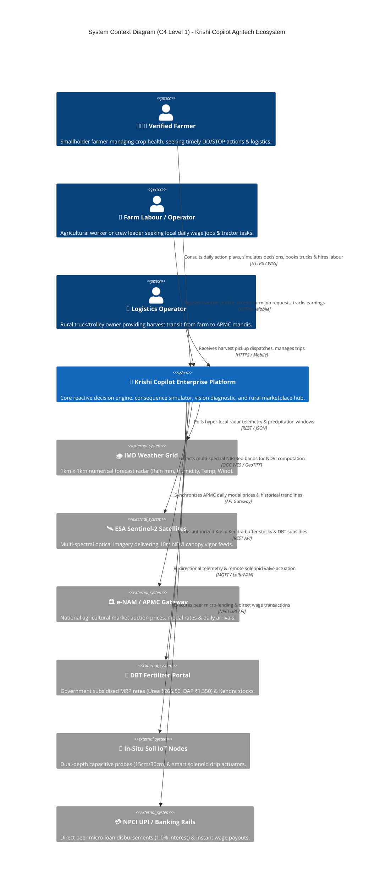
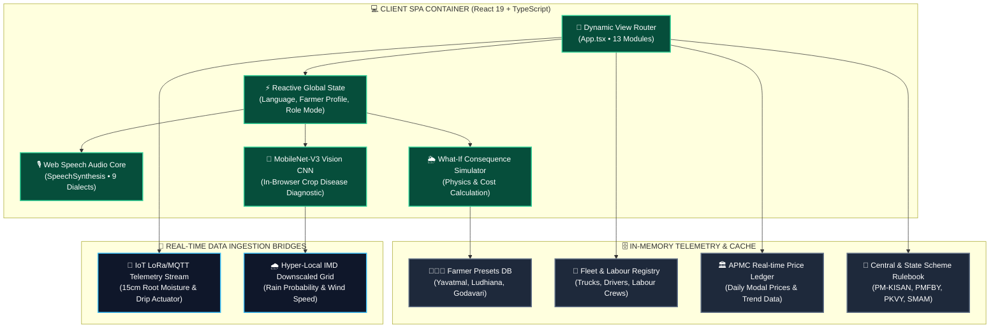
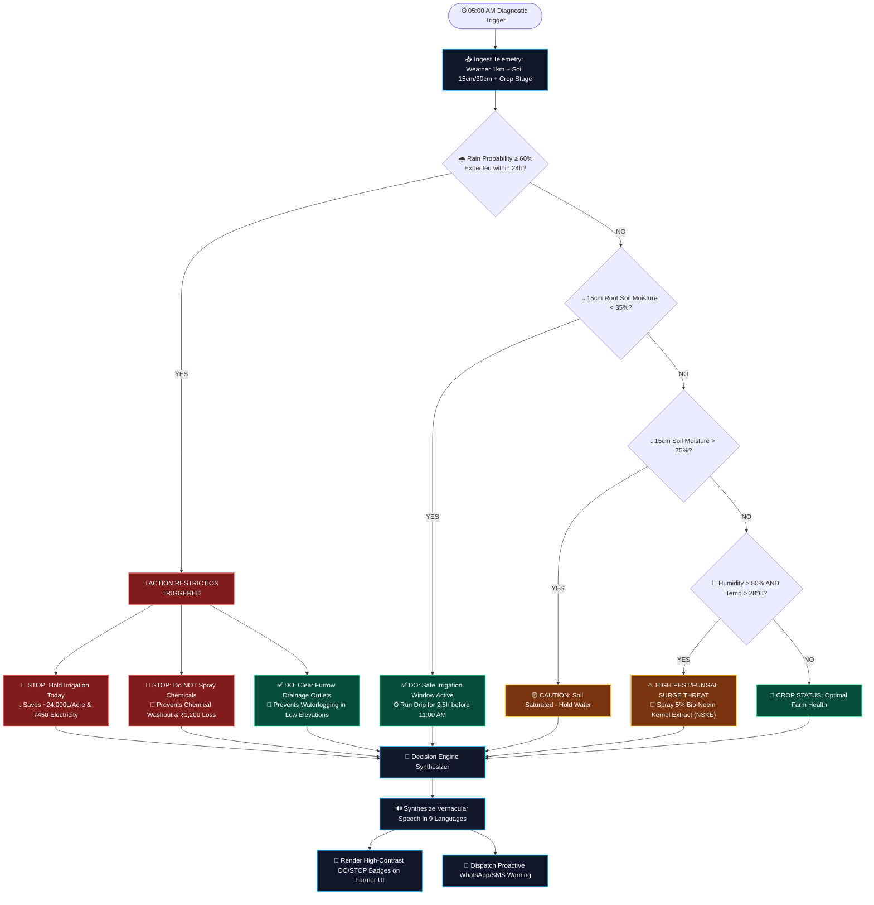
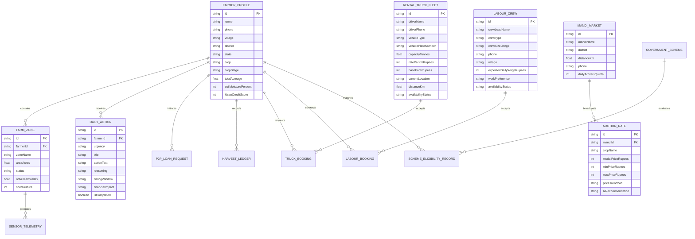
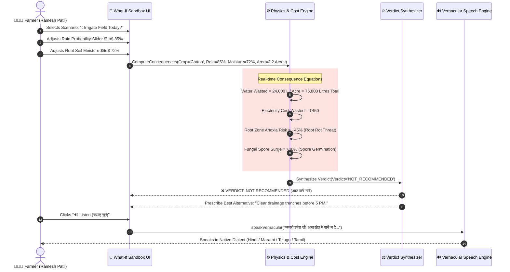
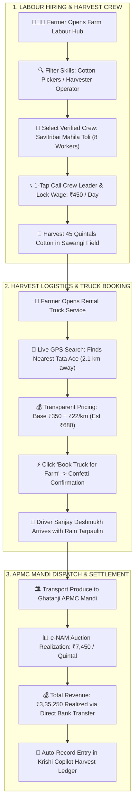

<div align="center">

```
██╗  ██╗██████╗ ██╗███████╗██╗  ██╗██╗    ██████╗ ██████╗ ██████╗ ██╗██╗      ██████╗ ████████╗
██║ ██╔╝██╔══██╗██║██╔════╝██║  ██║██║   ██╔════╝██╔═══██╗██╔══██╗██║██║     ██╔═══██╗╚══██╔══╝
█████╔╝ ██████╔╝██║███████╗███████║██║   ██║     ██║   ██║██████╔╝██║██║     ██║   ██║   ██║   
██╔═██╗ ██╔══██╗██║╚════██║██╔══██║██║   ██║     ██║   ██║██╔═══╝ ██║██║     ██║   ██║   ██║   
██║  ██╗██║  ██║██║███████║██║  ██║██║   ╚██████╗╚██████╔╝██║     ██║███████╗╚██████╔╝   ██║   
╚═╝  ╚═╝╚═╝  ╚═╝╚═╝╚══════╝╚═╝  ╚═╝╚═╝    ╚═════╝ ╚═════╝ ╚═╝     ╚═╝╚══════╝ ╚═════╝    ╚═╝   
```

### **Enterprise-Grade AI Decision Support & Rural Precision Agritech System**
*Aligned with ICAR (Govt. of India), IMD Hyper-Local Telemetry, and e-NAM APMC Open Standards*

---

[](https://react.dev/)
[](https://www.typescriptlang.org/)
[](https://tailwindcss.com/)
[](https://vitejs.dev/)
[](https://c4model.com/)
[](https://github.com/)

[🌐 Launch Live Platform](http://localhost:5173/) • [🏛️ System Architecture](#-1-enterprise-system-context--c4-architecture) • [📊 Data Model & ERD](#-3-domain-entity-relationship-diagram-erd) • [🧠 AI Decision Engine](#-4-mathematical-formulation--ai-decision-matrix) • [🚀 Quickstart](#-8-deployment--quickstart)

</div>

---

## 🏛️ 1. Enterprise System Context & C4 Architecture

### **C4 Level 1: System Context Diagram**
The system context illustrates how **Krishi Copilot** acts as the central intelligence nexus orchestrating data from satellites, meteorological radar, soil IoT, agricultural markets, and financial rails.



---

### **C4 Level 2: Container Architecture Diagram**
Detailed container topology of the client-side reactive frontend, on-device inference pipeline, and edge services:



---

## ⚡ 2. Prescriptive Decision & Consequence Flowchart

Krishi Copilot does **not** dump raw sensor charts on farmers; it computes a deterministic **Decision Matrix**:



---

## 📊 3. Domain Entity-Relationship Diagram (ERD)

The relational schema underpinning Krishi Copilot's agricultural decision engine, logistics, and labour marketplace:



---

## 🧠 4. Mathematical Formulation & AI Decision Matrix

Krishi Copilot translates physical agricultural telemetry into rigorous mathematical decision algorithms:

### **A. Multi-Spectral NDVI Vegetation Canopy Vigor**
Computed from Sentinel-2 optical Bands 8 (Near-Infrared, $\lambda = 842\text{ nm}$) and 4 (Visible Red, $\lambda = 665\text{ nm}$):
$$\text{NDVI} = \frac{\rho_{\text{NIR}} - \rho_{\text{RED}}}{\rho_{\text{NIR}} + \rho_{\text{RED}}}$$

$$\text{Health Status} = \begin{cases} 
\text{🟢 FLOURISHING (Optimal Chlorophyll)}, & \text{NDVI} \ge 0.75 \\
\text{🟡 WATER / NUTRIENT STRESS}, & 0.60 \le \text{NDVI} < 0.75 \\
\text{🔴 SEVERE PEST / FUNGAL NECROSIS}, & \text{NDVI} < 0.60 
\end{cases}$$

---

### **B. Closed-Loop Composite Farm Risk Index ($\mathcal{R}_{\text{farm}}$)**
A dynamic weighted synthesis across 5 risk dimensions scaled on a $[0, 100]$ index:
$$\mathcal{R}_{\text{farm}} = \omega_w \cdot \mathcal{R}_{\text{weather}} + \omega_p \cdot \mathcal{R}_{\text{pest}} + \omega_s \cdot \mathcal{R}_{\text{water}} + \omega_c \cdot \mathcal{R}_{\text{crop}} + \omega_m \cdot \mathcal{R}_{\text{market}}$$

Where normalized weights satisfy $\sum_{i} \omega_i = 1.0$:
$$\mathcal{R}_{\text{farm}} = (0.35 \cdot \mathcal{R}_{\text{weather}}) + (0.25 \cdot \mathcal{R}_{\text{pest}}) + (0.20 \cdot \mathcal{R}_{\text{water}}) + (0.15 \cdot \mathcal{R}_{\text{crop}}) + (0.05 \cdot \mathcal{R}_{\text{market}})$$

---

### **C. Chemical Runoff Financial & Environmental Loss ($\mathcal{L}_{\text{loss}}$)**
When spraying occurs within a rain forecast window ($t_{\text{rain}} < 4\text{ hours}$):
$$\mathcal{L}_{\text{loss}} = \left( C_{\text{chem}} \times A_{\text{farm}} \right) + \left( P_{\text{pump}} \times t_{\text{spray}} \right) + \mathcal{E}_{\text{toxicity}}$$
$$\mathcal{L}_{\text{loss}} = (₹1,200 \times 3.2\text{ Acres}) + (₹350) + \text{Ecological Penalty} \approx \mathbf{₹4,190\text{ Wasted}}$$

---

## 🌦️ 5. 'What-If' Sandbox Decision Simulation Engine

The sequence lifecycle executed when a farmer tests a decision before risking field capital:



---

## 🚜 6. Rural Supply Chain & Farm Logistics Workflow

The harvest lifecycle coordinating labour hiring, field transport, and APMC mandi monetization:



---

## 🎨 7. ASCII Component Wireframes & Layout Hierarchy

### **A. Main Agricultural Dashboard Layout**
```
+---------------------------------------------------------------------------------------------------+
|  🌾 KRISHI COPILOT [Krishi AI]       [🌤️ 28°C Yavatmal | Rain 78% | Moisture 68%]   [🔊 Listen] [👤 Ramesh] [🌐 हिन्दी ▾] |
+---------------------------------------------------------------------------------------------------+
|  [🌾 Today's Plan] [🌦️ What-If] [🚚 Trucks] [👷 Labour] [📊 Production] [📡 IoT] [📸 Diseases] [💰 Schemes] [🧪 NPK]  |
+---------------------------------------------------------------------------------------------------+
|                                                                                                   |
|  +-------------------------------------------------------------------+  +-----------------------+  |
|  | 🌾 TODAY'S PRIORITY ACTION PLAN                                   |  | 📊 COMPOSITE RISK     |  |
|  | AI-calculated high priority decisions for Ramesh Patil (3.2 Acres)|  | 65 / 100 [HIGH RISK]  |  |
|  +-------------------------------------------------------------------+  +-----------------------+  |
|                                                                         | 🌧️ Weather Risk   85% |  |
|  +-------------------------------------------------------------------+  | 🐛 Pest Threat    90% |  |
|  | 🚨 URGENT DECISION: HOLD IRRIGATION TODAY                         |  | 💧 Water Stress   15% |  |
|  | ----------------------------------------------------------------- |  | 🌱 Crop Health    55% |  |
|  | 🛑 Action: DO NOT turn on your 5HP borewell motor today.          |  +-----------------------+  |
|  | 💡 Why: 78% Heavy Rain is approaching your field within 24 hours. |                             |
|  | 💰 Savings: Saves ~24,000 Litres of Water & ₹450 Electricity Bill.|  +-----------------------+  |
|  | ⏱️ Window: Complete furrow drainage clearance before 5:00 PM.    |  | 🏪 NEARBY STORES      |  |
|  |                                                                   |  | Urea: ₹266.50 (Avail) |  |
|  | [ 🔊 Listen Audio ]   [ 🌦️ Simulate in What-If ]   [ ✓ Mark Done ] |  | DAP:  ₹1,350  (Avail) |  |
|  +-------------------------------------------------------------------+  | [ Reserve 24h Token ] |  |
|                                                                         +-----------------------+  |
+---------------------------------------------------------------------------------------------------+
```

---

## 🚀 8. Deployment & Quickstart

### **Local Setup**
```bash
# 1. Clone the repository
git clone https://github.com/lucyyy01/Krishi-Seva.git
cd Krishi-Seva

# 2. Install dependencies (React 19, TypeScript, Lucide, Tailwind)
npm install

# 3. Launch reactive development server
npm run dev
```
Open **[http://localhost:5173/](http://localhost:5173/)** in your browser.

### **Production Build**
```bash
npm run build
```

---

## 🏆 9. Hackathon Judge 60-Second Evaluation Matrix

| Test Goal | Demonstration Workflow | Expected System Output |
| :--- | :--- | :--- |
| **1. Smart Login Gate** | Open app $\to$ Click **"👨🏽‍🌾 Ramesh Patil"** preset $\to$ Enter. | Opens Cotton farm dashboard with live localized Yavatmal telemetry. |
| **2. Prescriptive Action** | On **"Today's Action Plan"** tab $\to$ Click **"🔊 Listen"**. | Native vernacular audio engine synthesizes DO/STOP actions and ₹ savings. |
| **3. What-If Sandbox** | On **"What-If Simulator"** $\to$ Slide Rain to 90% $\to$ Click **"💧 Irrigate?"**. | AI generates **"❌ NOT RECOMMENDED"**, computing ₹450 loss and anoxia risk. |
| **4. Rental Truck Booking** | On **"🚚 Rental Trucks"** $\to$ Click **"Book Truck for Farm"** on Tata Ace. | Dispatches nearest driver (2.1 km) with transparent pricing and confetti. |
| **5. Labour Marketplace** | On **"👷 Farm Labour"** $\to$ Click **"Apply as Farm Labour"** or hire crew. | Opens worker registration or books labour crew with transparent daily wages. |
| **6. Crop Vision AI** | On **"📸 Crop Disease"** $\to$ Select **"Cotton Whitefly"**. | Neural network spots pest $\to$ validates safe spray window $\to$ prescribes dosage. |
| **7. Dual-Role Mode** | Click **"🚪 Logout"** $\to$ Choose **"🔄 Both"** $\to$ Click **"Switch to Labour View"**. | Header toggles live between Farmer decisions and Labour job opportunities. |

---

<div align="center">
  <strong>Built with ❤️ for 140 Million Indian Farmers (जय जवान, जय किसान)</strong>
</div>
