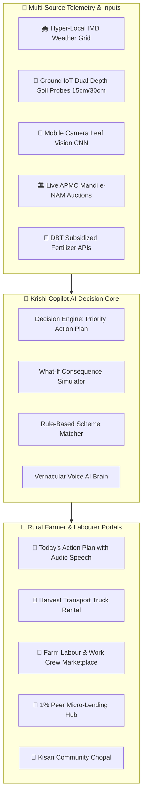

<div align="center">

# 🌾 Krishi Copilot (कृषि को-पायलट)
### *AI-Powered Integrated Farming Decision Support & Rural Agritech Platform*

[](https://react.dev/)
[](https://www.typescriptlang.org/)
[](https://tailwindcss.com/)
[](https://vitejs.dev/)
[](https://github.com/)
[](https://github.com/)

<p align="center">
  <strong>Telling farmers what action to take today, when, and why — with zero agricultural jargon.</strong>
</p>

[🚀 Live Demo](http://localhost:5173/) • [✨ Key Modules](#-platform-modules) • [🏗️ System Architecture](#️-system-architecture) • [🏆 Judge Cheat Sheet](#-hackathon-judge-cheat-sheet) • [⚡ Quickstart](#-quickstart-guide)

</div>

---

## 📌 Problem Statement & The "Krishi Copilot" Vision

> **PS5: Smart Krishi Assistant — Integrated Farming Support Platform**  
> Farmers currently scramble across 5–10 disconnected sources (weather portals, mandi traders, fertilizer dealers, moneylenders, government offices, and crop doctors) to make critical farm decisions.

### 🚜 What Makes Krishi Copilot Unique?
Instead of an overloaded information catalog, **Krishi Copilot** acts as an **AI Copilot** providing **prescriptive, timely, and actionable STOP / DO decisions**:

| Traditional Farming Apps ❌ | Krishi Copilot AI 🌾 ✅ |
| :--- | :--- |
| Shows raw generic district weather (e.g. *"78% rain"*). | Tells farmer: **"🚨 STOP! Hold irrigation today. You will save 24,000L water & ₹450 electricity."** |
| Lists 200+ government schemes in dense legal text. | Automatically calculates **"Why Eligible"** and **"Why NOT Eligible"** with 1-tap eligibility verification. |
| Text-heavy complex jargon that illiterate farmers cannot parse. | **1-Tap Vernacular Audio Speech** across **9 Indian Languages** with visual DO/STOP badge cards. |
| Disconnected from village ground reality. | Integrated with **Rental Truck Service**, **Labour Hiring Marketplace**, **IoT Root Moisture Telemetry**, and **Peer-to-Peer 1% Micro-Loans**. |

---

## 🏗️ System Architecture



---

## ✨ Platform Modules (Interactive Matrix)

<details open>
<summary><h3>1. 🌾 Today's Priority Action Plan (आज की कार्य योजना)</h3></summary>

* **Prescriptive DO / STOP Badges:** Real-time calculated actions (e.g. *Hold Irrigation, Clear Furrow Drainage Outlets, Spray Neem Oil for Whitefly*).
* **Clear Reasons & Financial Savings:** Explains exactly why the action is suggested, optimal timing window (e.g. *Before 5:00 PM*), and rupee savings.
* **🔊 1-Tap Audio Read-Aloud:** Text-to-speech in farmer's native dialect for accessibility.
* **Interactive Completion:** Check off completed tasks with real-time farm health score updates.
</details>

<details>
<summary><h3>2. 🌦️ 'What-If' Farm Decision Simulator (फार्म सिम्युलेटर)</h3></summary>

* **Risk Sandbox:** Test farm actions before executing them in the physical field.
* **Interactive Variable Sliders:** Adjust expected rainfall (0% to 100%) and soil moisture (20% to 90%).
* **Consequence Metrics:** Computes water wastage in litres, chemical rain washout loss in ₹, and disease escalation percentage.
* **4 Scenarios:**
  1. *💧 Irrigate Field Today?*
  2. *🐛 Spray Pesticide Now?*
  3. *🧪 Delay Fertilizer Application 4 Days?*
  4. *🌧️ Heavy Rain & Waterlogging Threat?*
</details>

<details>
<summary><h3>3. 🚚 Rental Truck Service & Harvest Transport (किराया ट्रक व परिवहन)</h3></summary>

* **Vehicle Types:** Tata Ace / Bolero Pickups (1.5–2T), High-Capacity Tractor Trolleys (4.5T), Medium Eicher (7.5T), Heavy 10-Tonne Multi-Axle Trucks.
* **Live GPS Distance:** Distance from farm (e.g. *2.1 km away at Ghatanji APMC Stand*).
* **Trip Rate Estimator:** Base fare + transparent ₹/km with automatic destination calculation.
* **1-Tap Direct Actions:** Direct phone call to driver + instant **"Book Truck for Farm"** dispatch button.
</details>

<details>
<summary><h3>4. 👷 Farm Labour & Harvester Hub (मजदूर व कामगार केंद्र)</h3></summary>

* **For Farmers (Hire Labour):**
  * Filter by skill: *Cotton Pickers (कपास चुनाई)*, *Paddy Sowing/Transplanting (धान रोपाई)*, *Combine / Tractor Operators*, *Sprayer Operators*.
  * View verified work crew groups (e.g. *Savitribai Mahila Shramik Group — Crew of 8 Workers*).
  * Transparent daily wage display (₹400–₹800/day) and 1-tap booking.
* **For Workers (Apply as Farm Labour):**
  * Registration modal for male workers, female workers, and work crew groups (Toli).
  * Captures daily wage expectation, village location, and skills.
</details>

<details>
<summary><h3>5. 📸 Crop Disease AI & Weather-Linked Spray Advisor</h3></summary>

* **Computer Vision Diagnostic:** Analyzes uploaded leaf photo or sample disease gallery.
* **Weather-Linked Spraying Window:** Validates if upcoming weather permits spraying (prevents toxic rain runoff).
* **Dual Treatment Options:**
  - 🧪 *Chemical Remedy:* Exact product name & 15L pump tank dosage.
  - 🌿 *Bio/Organic Treatment:* PKVY-approved neem oil / bio-fungicide alternatives.
</details>

<details>
<summary><h3>6. 💰 Government Scheme Matcher (योजना मिलान)</h3></summary>

* **"Why Eligible" & "Why NOT Eligible":** Explicitly breaks down eligibility criteria for 15+ Central & State schemes:
  - *PM-KISAN (₹6,000/yr)*
  - *PMFBY (Pradhan Mantri Fasal Bima Yojana)*
  - *PM-KUSUM (90% Solar Pump Subsidy)*
  - *SMAM (Farm Machinery Subsidy)*
  - *PKVY (Paramparagat Krishi Vikas Yojana - Organic)*
* **Direct Official Links:** Direct access to government portals + required document checklist.
</details>

<details>
<summary><h3>7. 🤝 P2P Kisan Micro-Lending Hub (किसान पी2पी ऋण)</h3></summary>

* **1.0% Monthly Interest:** Transparent peer micro-loans between verified local farmers & FPOs (bypasses 36%+ informal moneylenders).
* **Kisan Trust Score (300 - 900):** Credit scoring based on harvest history and landholding records.
* **Interactive UPI Funding:** 1-click simulated loan funding via UPI.
</details>

<details>
<summary><h3>8. 🏛️ APMC Mandi GPS Locator & Price Intelligence</h3></summary>

* **Real-time Auction Prices:** Modal price, Min/Max range, and 24-hour price trend indicators.
* **GPS Distance Matrix:** Shows closest mandis in km with 1-tap Google Maps directions and mandi office phone numbers.
* **AI Sell vs Store Recommendation:** Suggests whether to sell immediately or store in warehouse based on price momentum.
</details>

<details>
<summary><h3>9. 📡 IoT Hardware Hub & Smart Solenoid Drip Valve</h3></summary>

* **Dual-Depth Root-Zone Telemetry:** Live 15 cm shallow root moisture & 30 cm deep subsoil telemetry.
* **Remote Drip Valve Actuator:** 1-tap open/close solenoid irrigation valve from mobile.
* **Auto-Rain Guard:** Automatically cuts off valve power when rain probability exceeds 65%.
</details>

<details>
<summary><h3>10. 🌱 Subsidized Seeds & Fertilizer Store Locator</h3></summary>

* **DBT Subsidized Price Monitor:** Fixed MRP tracking for Urea (₹266.50 / 45kg bag), DAP (₹1,350 / 50kg bag), MOP (₹1,700).
* **Krishi Kendra Locator:** Check real-time stock levels at nearby authorized fertilizer dealers.
* **24h Token Reservation:** Reserve fertilizer bags before visiting the store.
</details>

<details>
<summary><h3>11. 👥 Kisan Community Chopal & Secondhand Machinery</h3></summary>

* **Kisan Chopal:** Rural discussion forum with verified answers from KVK Agronomists.
* **Secondhand Marketplace:** Buy and sell used tractors, rotavators, power tillers, and drip pipes directly between farmers with zero dealer commission.
</details>

<details>
<summary><h3>12. 🎙️ Vernacular Voice AI Copilot (आवाज से पूछें)</h3></summary>

* **Interactive Audio Waveform Visualizer:** Pulsing equalizer bars when speaking or listening.
* **Speech Rate Controls:** Switch playback speed between 0.8x (clear & slow), 1.0x (normal), and 1.2x (fast).
* **1-Click Smart Voice Prompts:**
  - *"क्या आज कपास में पानी देना चाहिए?" (Should I irrigate today?)*
  - *"मेरी फसल में कीड़े लगे हैं, कौन सी दवाई डालें?" (Which pesticide for pests?)*
  - *"यूरिया और डीएपी खाद का सरकारी भाव क्या है?" (Subsidized fertilizer rates?)*
</details>

---

## 🇮🇳 Full Multilingual Support (9 Indian Languages)

Krishi Copilot features dynamic real-time language synchronization across every button, card, modal, and voice output:

```
├── 🇮🇳 हिन्दी (Hindi)
├── 🇮🇳 मराठी (Marathi)
├── 🇮🇳 తెలుగు (Telugu)
├── 🇮🇳 தமிழ் (Tamil)
├── 🇮🇳 ಕನ್ನಡ (Kannada)
├── 🇮🇳 ગુજરાતી (Gujarati)
├── 🇮🇳 ਪੰਜਾਬੀ (Punjabi)
├── 🇮🇳 বাংলা (Bengali)
└── 🌐 English
```

---

## 🏆 Hackathon Judge Cheat Sheet

| Judge Test Goal | How to Test in the Live App | Expected Output |
| :--- | :--- | :--- |
| **1. Test Login & Role Gate** | Reload page $\to$ View **Smart Login Gateway** $\to$ Click **"👨🏽‍🌾 Ramesh Patil"** preset or enter phone $\to$ Click **"Verify & Login"**. | Opens full personalized dashboard for Yavatmal Cotton farmer. |
| **2. Test Prescriptive AI** | Go to **"Today's Action Plan"** tab $\to$ Click **"🔊 Listen"**. | AI reads out prioritized action and water/cost savings in native language. |
| **3. Test What-If Simulator** | Go to **"'What-If' Simulator"** tab $\to$ Drag Rain slider to 90% $\to$ Click **"💧 Irrigate Field Today?"**. | AI renders **"❌ NOT RECOMMENDED"** verdict, computing ₹450 electricity loss & root rot risk. |
| **4. Test Rental Trucks** | Go to **"🚚 Rental Trucks"** tab $\to$ Click **"Book Truck for Farm"** on Tata Ace. | Dispatches truck with live distance, base fare + ₹/km, and confetti confirmation. |
| **5. Test Labour Hub** | Go to **"👷 Farm Labour"** tab $\to$ Click **"Apply as Farm Labour"** or hire a crew. | Registers worker profile or books crew with daily wage rates. |
| **6. Test Crop Disease AI** | Go to **"📸 Crop Disease"** tab $\to$ Select **"Cotton Whitefly / Leaf Curl"**. | Displays weather-linked safe spray window + exact 15L tank dosage. |
| **7. Test Voice Assistant** | Click the floating **🎙️ Krishi Voice Copilot** button at bottom right $\to$ Click any voice chip. | Audio visualizer animates and reads advice with 0.8x/1.0x rate toggle. |

---

## ⚡ Quickstart Guide

### Prerequisites
- [Node.js](https://nodejs.org/) (v18 or higher recommended)
- [npm](https://www.npmjs.com/) or [yarn](https://yarnpkg.com/)

### 1. Clone & Navigate
```bash
git clone https://github.com/your-username/krishi-copilot.git
cd krishi-copilot
```

### 2. Install Dependencies
```bash
npm install
```

### 3. Start Development Server
```bash
npm run dev
```
Open **[http://localhost:5173/](http://localhost:5173/)** in your browser.

### 4. Production Build
```bash
npm run build
```

---

## 🛠️ Technology Stack

| Layer | Technology | Purpose |
| :--- | :--- | :--- |
| **Frontend Framework** | React 19 + TypeScript | High performance, type-safe reactive UI |
| **Styling & Layout** | Tailwind CSS 3.4 | Fluid responsive styling, dark glassmorphism & accessibility |
| **Build Tool** | Vite 6 | Sub-second hot module reloading & minified bundling |
| **Icons & Animations** | Lucide React + Canvas Confetti | Visual affordances and interaction feedback |
| **Speech & Audio** | Web Speech Synthesis API | Native vernacular speech without external API latency |
| **State Management** | React Context & Reactive State | Instant zero-reload language and profile switching |

---

## 👥 Contributors & Acknowledgements

* **Developed for:** Smart India Hackathon & National Agritech Challenges (PS5: Smart Krishi Assistant).
* **Data Standards:** Aligned with **ICAR** (Indian Council of Agricultural Research), **IMD** (India Meteorological Department), and **e-NAM** (National Agriculture Market).

---

<div align="center">
  <strong>Made with ❤️ for Indian Farmers (जय जवान, जय किसान)</strong>
</div>
